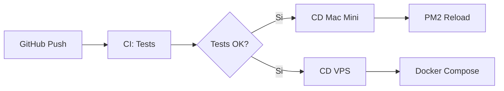

# Pipeline CI/CD para Arquitectura Distribuida

Este documento describe el pipeline de despliegue continuo definido en `specs/Pipeline_de_Despliegue_Continuo_(CI_CD)_para_Arquitectura_Distribuida.md`.

## Topología



## Workflow

El workflow `.github/workflows/deploy.yml` se ejecuta en cada push a `main`:

1. **test** (ubuntu-latest): pytest, mypy, validación SQL con sqlglot
2. **deploy-mac** (self-hosted): PM2 reload, health check, rollback automático si falla
3. **deploy-vps** (ubuntu-latest): SSH al VPS, git pull, docker compose up
4. **notify**: mensaje a Telegram con commit y estado

## Secretos de GitHub

Configurar en **Settings → Secrets and variables → Actions**:

| Secreto | Uso |
|---------|-----|
| `VPS_IP` | IP del VPS (ej. 66.94.106.1 o Tailscale) |
| `VPS_USER` | Usuario SSH (ej. capadonna) |
| `VPS_SSH_KEY` | Clave privada SSH para el VPS |
| `TELEGRAM_BOT_TOKEN` | Token del bot DuckClaw |
| `TELEGRAM_CHAT_ID` | ID del canal/grupo para notificaciones |
| `VPS_DEPLOY_PATH` | (opcional) Ruta en VPS; default `/opt/duckclaw-vps` |

## Self-hosted Runner (Mac Mini)

Para que el job `deploy-mac` funcione, el Mac Mini debe tener un runner de GitHub Actions registrado:

1. En el repo: **Settings → Actions → Runners → New self-hosted runner**
2. Seleccionar macOS y seguir las instrucciones
3. Añadir la etiqueta `mac-mini` al runner (o ajustar `runs-on: [self-hosted, mac-mini]` en el workflow)
4. El runner debe tener instalado:
   - Python 3.9+
   - uv (`curl -LsSf https://astral.sh/uv/install.sh | sh`)
   - PM2 (`npm install -g pm2`)
   - El repo clonado en el directorio donde PM2 espera el proyecto

## Estructura en VPS

El VPS debe tener:

- Repo clonado en `/opt/duckclaw-vps` (o la ruta indicada en `VPS_DEPLOY_PATH`)
- `docker-compose.yml` en ese directorio (para n8n u otros servicios)
- Clave SSH del usuario configurada en `VPS_SSH_KEY` añadida a `~/.ssh/authorized_keys`

Si la estructura actual usa `~/n8n`, configurar `VPS_DEPLOY_PATH` en los secretos con la ruta correcta.

## systemd (n8n, Postgres, DuckClaw-Brain, DuckClaw-Gateway)

Si n8n, Postgres, DuckClaw-Brain o DuckClaw-Gateway se ejecutan como servicios (no Docker), usar los unit files. **Ejecutar desde el directorio del proyecto en el VPS** (ej. `cd /home/capadonna/duckclaw`):

```bash
sudo cp scripts/systemd/n8n.service /etc/systemd/system/
sudo cp scripts/systemd/postgres.service /etc/systemd/system/  # opcional
sudo cp scripts/systemd/DuckClaw-Brain.service /etc/systemd/system/
sudo cp scripts/systemd/DuckClaw-Gateway.service /etc/systemd/system/
sudo cp scripts/systemd/DuckClaw-Homeostasis-TaskAsk.service /etc/systemd/system/
sudo cp scripts/systemd/DuckClaw-Homeostasis-TaskAsk.timer /etc/systemd/system/
sudo systemctl daemon-reload
sudo systemctl enable n8n DuckClaw-Brain DuckClaw-Gateway DuckClaw-Homeostasis-TaskAsk.timer
sudo systemctl start n8n DuckClaw-Brain DuckClaw-Gateway
sudo systemctl start DuckClaw-Homeostasis-TaskAsk.timer
```

Ajustar `User`, `WorkingDirectory` y `ExecStart` según la instalación (ej. DuckClaw-Brain usa `/home/capadonna/duckclaw`).

**Homeostasis "Ask Task":** ver [docs/homeostasis_n8n.md](homeostasis_n8n.md) para configurar el webhook a n8n y el timer que pregunta "¿Qué tarea hacer?".

**Ver logs:**
```bash
sudo journalctl -u DuckClaw-Brain -f    # logs en vivo (Ctrl+C para salir)
sudo journalctl -u DuckClaw-Brain -n 100  # últimas 100 líneas
```

## Validación Tailscale (n8n -> DuckClaw)

Desde el VPS, validar que n8n puede alcanzar la Mac Mini vía Tailscale:

```bash
# IP Tailscale de la Mac Mini (tailscale ip -4 en la Mac)
export DUCKCLAW_TAILSCALE_IP=100.x.y.z
bash scripts/validate_n8n_tailscale.sh
```

Flujo: n8n (VPS) → webhook HTTP → DuckClaw API (Mac Mini) vía IP Tailscale. El tráfico permanece cifrado E2EE en el túnel.

## Health Check y Rollback

En el Mac Mini, tras `pm2 reload`, el workflow hace un health check contra:

- `http://localhost:8123/health` (API)
- o `http://localhost:8080/health` (MLX)

Si falla, se ejecuta rollback automático: `git checkout HEAD~1`, `uv sync --extra agents`, `pm2 reload`.

## Dependencias de desarrollo

Para ejecutar localmente los mismos checks que el CI:

```bash
uv sync --extra agents --extra dev
uv run pytest tests/ -v
uv run mypy duckclaw/
uv run python scripts/validate_sql.py
```

## Trazabilidad en LangSmith

La spec sugiere registrar cada despliegue como evento. Opciones:

- Usar `LANGCHAIN_TRACING_V2=true` para que las trazas del bot incluyan el contexto
- Añadir manualmente un tag o metadata con `deploy_version` / `commit_hash` en el próximo invoke
