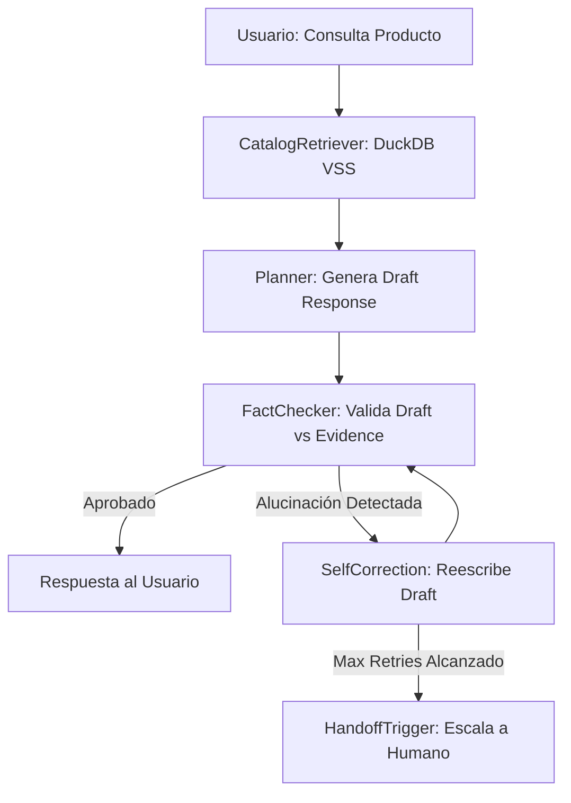

# Especificación Técnica: RAG Fact-Checker y Prevención de Alucinaciones (Context-Guard)

## 1. Objetivo Arquitectónico

Implementar un nodo Validator obligatorio en el grafo de LangGraph para los trabajadores virtuales basados en conocimiento (ej. SupportWorker de Power Seal). Este nodo actúa como un **Context-Guard**, garantizando matemáticamente y semánticamente que el LLM no invente especificaciones técnicas, precios o disponibilidad de inventario que no existan en la evidencia cruda (`raw_evidence`) recuperada de DuckDB VSS.

## 2. Topología del Grafo (Bucle de Auto-Corrección)



## 3. Especificación de Skill: FactCheckerNode

Este nodo se ejecuta inmediatamente después de que el agente genera una respuesta preliminar (`draft_response`), pero antes de enviarla al API Gateway.

**Entrada:**
- `user_query` (String)
- `raw_evidence` (JSON Array devuelto por CatalogRetriever)
- `draft_response` (String generado por el LLM)

**Lógica Interna (LLM-as-a-Judge):**
1. **Extracción de Afirmaciones (Claims):** Identificar entidades críticas en el draft_response (SKUs, precios, materiales, dimensiones).
2. **Verificación de Entailment (Implicación):** Inyectar un prompt estricto a un modelo rápido (ej. Llama-3.2-3B) evaluando si las afirmaciones están respaldadas exclusivamente por el raw_evidence.
3. **Puntuación:** Asignar un FactualityScore (0.0 a 1.0).

**Salida:** `ValidationResult` (Boolean `is_safe`, String `correction_feedback`).

## 4. Contrato de Prompting (Fact-Checking)

El prompt del FactCheckerNode debe ser determinista y binario:

```markdown
<system>
Eres un auditor de cumplimiento estricto (Context-Guard). Tu única tarea es verificar si la RESPUESTA_PROPUESTA contiene información que NO está explícitamente presente en la EVIDENCIA_CRUDA.

Reglas de Auditoría:
1. Si la respuesta menciona un precio, SKU o característica técnica que no está en la evidencia, marca "is_safe": false.
2. Si la respuesta asume disponibilidad de stock sin que la evidencia lo confirme, marca "is_safe": false.
3. Si la respuesta está 100% respaldada por la evidencia, marca "is_safe": true.
</system>

<evidencia_cruda>
{raw_evidence}
</evidencia_cruda>

<respuesta_propuesta>
{draft_response}
</respuesta_propuesta>

Devuelve ÚNICAMENTE un JSON válido: {"is_safe": boolean, "feedback": "razón de la falla o null"}
```

## 5. Especificación de Skill: SelfCorrectionNode

Si el FactCheckerNode devuelve `is_safe: false`, el grafo enruta a este nodo.

**Entrada:** `draft_response`, `correction_feedback`, `raw_evidence`.

**Lógica:**
1. Incrementar el contador `correction_retries` en el estado del grafo.
2. Si `correction_retries > 2`, abortar y disparar HandoffTrigger (escalar a humano).
3. Si `correction_retries <= 2`, solicitar al LLM que reescriba la respuesta utilizando el `correction_feedback`.

**Prompt de Corrección:** "Tu respuesta anterior fue rechazada por el auditor por la siguiente razón: {correction_feedback}. Reescribe la respuesta basándote ÚNICAMENTE en esta evidencia: {raw_evidence}."

## 6. Integración con Habeas Data y Auditoría (LangSmith)

- **Trazabilidad de Alucinaciones:** Cada vez que el FactCheckerNode rechaza un draft_response, el evento debe etiquetarse en LangSmith como `hallucination_prevented`.
- **Bucle SFT:** Las trazas donde el FactCheckerNode aprueba la respuesta en el primer intento (`correction_retries == 0`) se exportan automáticamente al SFT_DataCollector para el re-entrenamiento continuo del modelo en MLX, reforzando el comportamiento seguro.

## 7. Configuración en Manifest

```yaml
context_guard:
  enabled: true
  max_retries: 2
```

Si el worker tiene `catalog_retriever` y `context_guard.enabled: true`, el grafo incluye el bucle FactChecker → SelfCorrection.
