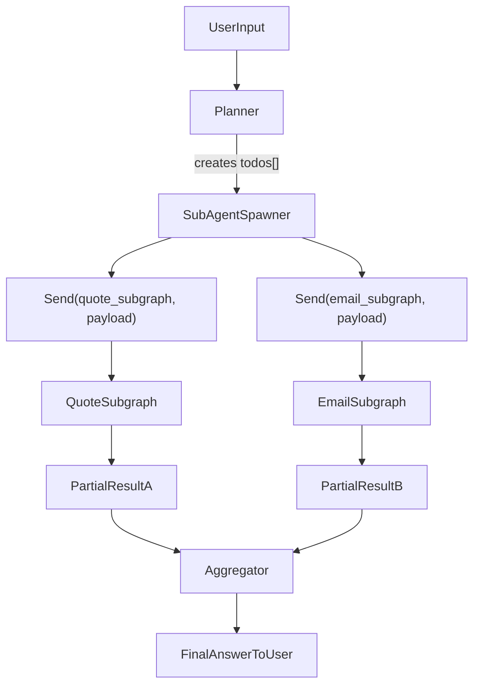

# Sucagent Spawning & Context Hub

No vamos a reescribir `duckclaw`, pero vamos a **"robar" los mejores patrones** de ambas tecnologías e inyectarlos en tu arquitectura actual.

## A. Inspiración de Deep Agents: `SubAgentSpawner`
Actualmente, tu `Router` delega a un solo worker. Vamos a adoptar el patrón de *Subagent Spawning* de LangChain para tareas complejas.

*   **Especificación:** Modificar el nodo `Executor` en LangGraph. Si el usuario pide: *"Cotízame 50 abrazaderas y envíale un resumen a mi socio"*, el agente principal no lo hace secuencialmente.
*   **Lógica:** El agente principal genera un plan (`write_todos`) y lanza dos sub-grafos efímeros en paralelo (`asyncio.gather`):
    1.  Sub-agente A: Ejecuta `QuoteEngine`.
    2.  Sub-agente B: Ejecuta `n8n_bridge` para el correo.
*   **Ventaja:** Reduces la latencia a la mitad sin cambiar de framework.

## B. Integración de Context Hub: `API_GroundTruth_Skill`
Vamos a integrar la herramienta de Andrew Ng directamente en tu `StrixSandbox` y en el `SkillRegistry`.

### Especificación de Skill: `ContextHubBridge`
*   **Propósito:** Evitar que el agente alucine cuando deba escribir integraciones o consultar APIs externas.
*   **Instalación en VPS/Mac:** Instalar el CLI de Context Hub (`npm install -g @context-hub/cli` o el binario correspondiente).
*   **Contrato de Herramienta (Python):**
    ```python
    from langchain_core.tools import tool
    import subprocess

    @tool
    def fetch_api_docs(api_name: str) -> str:
        """
        Usa esta herramienta ANTES de escribir código para interactuar con una API externa.
        Descarga la documentación oficial y actualizada (Ground Truth).
        Ejemplo: fetch_api_docs("interactive-brokers")
        """
        try:
            # Ejecuta el CLI de Andrew Ng
            result = subprocess.run(["chub", "get", f"{api_name}/docs", "--lang", "python"],
                capture_output=True, text=True, check=True
            )
            return result.stdout
        except subprocess.CalledProcessError:
            return "Documentación no encontrada en Context Hub. Procede con precaución."
    ```

### C. Evolución de la Memoria (Anotaciones)
Context Hub usa `chub annotate` para que el agente recuerde errores de APIs. Nosotros ya tenemos algo mejor: **DuckDB PGQ**.
*   **Mejora:** Cuando el `FactCheckerNode` o el `StrixSandbox` detecten que una llamada a una API falló y el agente la corrigió, el `GraphLeadProfiler` debe guardar esa lección como un nodo en el grafo:
    `(Agent)-[:LEARNED_WORKAROUND {api: "IBKR", error: "401", fix: "Use Bearer token"}]->(Knowledge)`
*   Esto hace que tu agente sea **Self-Improving** (Auto-mejorable) a nivel de base de datos, superando la propuesta de archivos locales de Context Hub.

---

## Especificación normativa v1 (Subagent Spawning & Context Hub)

Lo anterior es la versión corta e inspiracional. A continuación se define la **especificación normativa** que debe seguir la implementación real en DuckClaw.

### 1. Estado actual y vocabulario

- **Gateway / Router**: recibe mensajes (Telegram/Web) y los enruta a un **worker principal**.
- **Worker principal**: agente que hoy resuelve toda la tarea secuencialmente.
- **DuckClaw (C++ / DuckDB)**: capa de acceso a la base de datos compartida, ya usada por Gateway y workers.
- **PGQ**: modelo de grafo sobre tablas `memory_nodes` y `memory_edges` en DuckDB.

Vocabulario normativo:

- **Agente principal**: orquestador de la conversación; decide si una petición requiere subtareas.
- **Subagente**: sub-grafo efímero (subgraph) lanzado por el `SubAgentSpawner` con un objetivo concreto.
- **Planner**: nodo que traduce una petición compleja en una lista de subtareas (`todos`).
- **SubAgentSpawner**: nodo que, a partir de los `todos`, devuelve una lista de `Send(subgraph_name, payload)` de LangGraph.
- **Aggregator**: nodo que combina resultados parciales en una única respuesta al usuario.
- **ContextHubBridge**: skill/herramienta que trae documentación oficial de APIs (Ground Truth).
- **GraphLeadProfiler**: componente que registra en PGQ los aprendizajes (`LEARNED_WORKAROUND`) sobre errores de APIs.

### 2. Arquitectura de Subagent Spawning (LangGraph `Send`)

#### 2.1 Flujo general

Ejemplo de petición:  
> “Cotízame 50 abrazaderas y envíale un resumen a mi socio”

Flujo normativo:

1. **Gateway** recibe la petición (Telegram / HTTP) y la pasa al **agente principal**.
2. El **Planner** transforma la petición en una lista de subtareas (`todos`).
3. El **SubAgentSpawner** toma los `todos` y devuelve una **lista de `Send(...)`** para que LangGraph lance sub-grafos efímeros en **paralelo**.
4. Cada **subagente** ejecuta su propio subgraph (ej. `quote_subgraph`, `email_subgraph`).
5. Los resultados parciales llegan al **Aggregator**, que construye la respuesta final.
6. El Gateway muestra progreso al usuario vía **SSE** (ver 2.4).

#### 2.2 Contrato del Planner → SubAgentSpawner

Entrada al `SubAgentSpawner` (ejemplo conceptual):

```json
{
  "correlation_id": "uuid-sesion",
  "user": {
    "id": "telegram_user_id",
    "channel": "telegram"
  },
  "todos": [
    {
      "task_id": "quote-1",
      "description": "Cotizar 50 abrazaderas",
      "tooling_context": ["QuoteEngine"],
      "parallelizable": true,
      "priority": 1
    },
    {
      "task_id": "email-1",
      "description": "Enviar resumen de la cotización al socio",
      "tooling_context": ["n8n_bridge"],
      "parallelizable": true,
      "priority": 2
    }
  ]
}
```

#### 2.3 Contrato del SubAgentSpawner (LangGraph `Send`)

En LangGraph v0.2+, el patrón de Map-Reduce / Subagent Spawning se implementa devolviendo **objetos `Send`**.

Normas:

- El `SubAgentSpawner` **no** usa `asyncio.gather` ni hilos manuales.
- El nodo retorna una **lista de `Send(subgraph_name, payload)`** y delega paralelismo, reintentos y persistencia al runtime de LangGraph (incluido el Checkpointer).

Ejemplo conceptual:

```python
from langgraph.types import Send

def subagent_spawner_node(state):
    todos = state["todos"]
    sends = []
    for todo in todos:
        if todo["task_id"].startswith("quote-"):
            sends.append(
                Send(
                    "quote_subgraph",
                    {
                        "task_id": todo["task_id"],
                        "description": todo["description"],
                        "correlation_id": state["correlation_id"],
                        "user": state["user"],
                    },
                )
            )
        if todo["task_id"].startswith("email-"):
            sends.append(
                Send(
                    "email_subgraph",
                    {
                        "task_id": todo["task_id"],
                        "description": todo["description"],
                        "correlation_id": state["correlation_id"],
                        "user": state["user"],
                    },
                )
            )
    return sends
```

El grafo principal define los subgraphs `quote_subgraph` y `email_subgraph` usando la API de LangGraph.

#### 2.4 Contrato de observabilidad: SSE para Angular

El **API Gateway** emite eventos Server-Sent Events (SSE) para que el `ParallelTaskIndicatorComponent` (Angular, Wizard-Interface) muestre el progreso de subtareas en paralelo.

Eventos mínimos:

1. **Inicio de subagentes**

```json
{
  "event": "subagents_started",
  "correlation_id": "uuid-sesion",
  "user_id": "telegram_user_id",
  "tasks": [
    {
      "task_id": "quote-1",
      "label": "Cotizar 50 abrazaderas",
      "status": "running"
    },
    {
      "task_id": "email-1",
      "label": "Enviar resumen al socio",
      "status": "running"
    }
  ],
  "total_parallel_tasks": 2
}
```

2. **Actualización de estado de subagentes**

```json
{
  "event": "subagents_updated",
  "correlation_id": "uuid-sesion",
  "tasks": [
    {
      "task_id": "quote-1",
      "status": "completed"
    },
    {
      "task_id": "email-1",
      "status": "running"
    }
  ]
}
```

3. **Finalización de todas las subtareas**

```json
{
  "event": "subagents_finished",
  "correlation_id": "uuid-sesion"
}
```

Normas:

- El Gateway emite `subagents_started` **justo después** de generar la lista de `Send`.
- El componente Angular escucha estos eventos y muestra:  
  “Ejecutando 2 tareas en paralelo…”.

#### 2.5 Diagrama de flujo (Subagent Spawning)



### 3. Skill `ContextHubBridge` (Ground Truth de APIs)

#### 3.1 Propósito

Evitar que el agente alucine cuando debe escribir integraciones o consultar APIs externas:

- Antes de generar código o llamadas a una API externa, el sistema **debe** intentar obtener la documentación oficial/actualizada usando `ContextHubBridge`.

#### 3.2 Contrato de herramienta

- **Nombre lógico**: `ContextHubBridge`.
- **Entradas**:
  - `api_name: str` (obligatorio), por ejemplo `"interactive-brokers"` o `"stripe"`.
  - `resource: str` (opcional), por ejemplo `"docs"`, `"openapi"`, `"examples"`.
- **Salida**:
  - Texto estructurado (markdown o JSON) con documentación relevante.
  - En caso de error: mensaje claro `"Documentación no encontrada en Context Hub. Procede con precaución."`.

Ejemplo conceptual:

```python
from langchain_core.tools import tool
import subprocess
import os

@tool
def context_hub_bridge(api_name: str, resource: str = "docs") -> str:
    """
    Usa esta herramienta ANTES de escribir código para interactuar con una API externa.
    Descarga la documentación oficial y actualizada (Ground Truth).
    """
    base_cmd = [
        "chub",
        "get",
        f"{api_name}/{resource}",
        "--lang",
        "python",
    ]
    env = os.environ.copy()
    try:
        result = subprocess.run(
            base_cmd,
            capture_output=True,
            text=True,
            check=True,
            env=env,
        )
        return result.stdout
    except subprocess.CalledProcessError:
        return "Documentación no encontrada en Context Hub. Procede con precaución."
```

#### 3.3 Integración con la configuración del sistema

- En el entorno del Gateway/Workers deben estar disponibles:
  - `CONTEXT_HUB_API_KEY` (si el CLI lo requiere).
  - `CONTEXT_HUB_BASE_URL` (si se usa un endpoint custom).
- El binario/CLI `chub` **debe** estar en el `PATH` del proceso que ejecuta los workers.

#### 3.4 Flujo de uso

1. El Planner o un subagente detecta que necesita interactuar con una API externa no trivial.
2. Antes de generar código o llamar a la API:
   - Invoca `ContextHubBridge(api_name, resource="docs")`.
3. El resultado se añade al contexto del agente como **ground truth**:
   - Parte del prompt del LLM.
   - O como contexto adicional en el estado de LangGraph.

### 4. Evolución de la memoria en DuckDB (PGQ sobre `memory_nodes` y `memory_edges`)

#### 4.1 Restricción: sin tablas nuevas

Norma estricta:

- **No** se crearán tablas nuevas para almacenar patrones de errores.
- Toda la memoria de trabajo se modela sobre las tablas existentes:
  - `memory_nodes`
  - `memory_edges`

#### 4.2 Modelo lógico `LEARNED_WORKAROUND`

Cuando el `FactCheckerNode` o el `StrixSandbox` detecten que:

1. Una llamada a una API falló (por ejemplo, error HTTP 401).
2. El agente encontró una corrección válida (por ejemplo, “usar Bearer token”).

El `GraphLeadProfiler` debe persistir un patrón de workaround como grafo PGQ:

- Nodo origen:
  - `(Agent {id: "engineer_worker"})`
- Nodo destino:
  - `(API {name: "IBKR"})`
- Arista:
  - `[:LEARNED_WORKAROUND {error_pattern: "401", fix: "Use Bearer"}]`

Esto implica:

- En `memory_nodes`:
  - Un nodo con tipo `Agent` y propiedad `id = "engineer_worker"`.
  - Un nodo con tipo `API` y propiedad `name = "IBKR"`.
- En `memory_edges`:
  - Una arista de tipo `LEARNED_WORKAROUND` entre esos nodos, con propiedades:
    - `error_pattern = "401"`
    - `fix = "Use Bearer"`
    - `created_at` (timestamp opcional).

#### 4.3 Uso en ejecución

Flujo normativo:

1. Antes de fallar definitivamente ante un error de API, el sistema consulta en PGQ:
   - ¿Existe alguna arista `LEARNED_WORKAROUND` para `(Agent, API)` y `error_pattern` compatible?
2. Si existe:
   - El agente intenta aplicar el `fix` recomendado (por ejemplo, actualizar cabeceras o parámetros).
3. Si no existe:
   - Si el agente descubre manualmente un fix que funciona, se registra un nuevo `LEARNED_WORKAROUND`.

#### 4.4 Diagrama lógico de grafo

```mermaid
flowchart LR
  agentNode[Agent(engineer_worker)] -->|"LEARNED_WORKAROUND {error_pattern: '401', fix: 'Use Bearer'}"| apiNode[API(IBKR)]
```

### 5. Plan de implementación (no ejecutado aún)

Esta sección define **dónde** se implementarán los cambios, pero no implica que el código exista todavía.

- Integrar Planner y SubAgentSpawner en el grafo principal del Gateway.
- Registrar `ContextHubBridge` en el registry de skills/herramientas de los workers.
- Extender la capa de PGQ para escribir/leer `LEARNED_WORKAROUND` usando solo `memory_nodes` y `memory_edges`.
- Añadir/ajustar el endpoint SSE del Gateway para emitir `subagents_started`, `subagents_updated`, `subagents_finished`.
- Ajustar el `ParallelTaskIndicatorComponent` en Angular para consumir estos SSE.