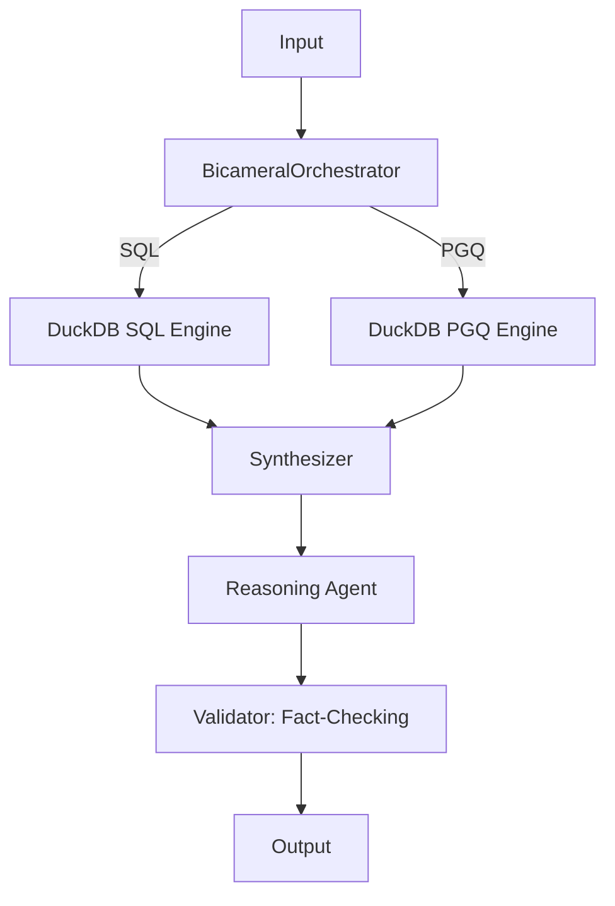

Arquitectura de Memoria Bicameral

## 1. Objetivo
Implementar una memoria unificada en **DuckDB** utilizando **Property Graph Queries (PGQ)**. La memoria operativa (OLAP) y la memoria asociativa (Grafo) residen en el mismo archivo `.db`, garantizando atomicidad, consistencia y soberanía de datos.

## 2. Arquitectura de Datos (Schema)
*   **Cámara OLAP (Tablas):** Datos transaccionales y series temporales.
*   **Cámara Semántica (Grafos):** Definición de grafos mediante `CREATE PROPERTY GRAPH`.
    *   **Nodos:** Entidades (ej. `Person`, `Transaction`, `Category`).
    *   **Aristas:** Relaciones (ej. `SENT_TO`, `BELONGS_TO`, `RELATED_TO`).

## 3. Especificación de Skills

### Skill: `BicameralOrchestrator`
*   **Entrada:** `user_query` (string).
*   **Lógica:**
    1.  **Router:** Clasifica la intención.
    2.  **Query Builder:**
        *   Si es **Analítica**: Genera SQL estándar (SELECT, SUM, AVG).
        *   Si es **Semántica**: Genera `GRAPH_TABLE` queries (PGQ).
    3.  **Execution:** Ejecuta ambas consultas en el mismo contexto de conexión de DuckDB.
*   **Salida:** `ContextualizedPrompt` (datos estructurados + relaciones de grafo).

### Skill: `DuckDB_Native_Engine`
*   **Propósito:** Ejecución unificada de SQL y PGQ.
*   **Lógica:**
    *   **Definición:** `CREATE PROPERTY GRAPH` para mapear tablas existentes a nodos y aristas.
    *   **Consulta:** Uso de `GRAPH_TABLE` para realizar recorridos de grafos (ej. encontrar transacciones relacionadas a una entidad específica a través de múltiples saltos).
    *   **Seguridad:** `SQLValidator` (AST-based) debe permitir ahora la sintaxis `GRAPH_TABLE`.

## 4. Flujo de Razonamiento (LangGraph)



## 5. Protocolo de Implementación (Specs Driven)

1.  **Normalización de Rutas:** Todas las DBs deben residir en `db/`.
    *   `db/duckclaw.db` contendrá tanto las tablas relacionales como la definición del grafo.
2.  **Definición del Grafo:**
    ```sql
    CREATE PROPERTY GRAPH financial_graph
    VERTEX TABLES (
        accounts,
        transactions
    )
    EDGE TABLES (
        transfers SOURCE KEY (from_account) REFERENCES accounts,
                  DESTINATION KEY (to_account) REFERENCES accounts
    );
    ```
3.  **Consulta de Grafo (Ejemplo):**
    ```sql
    SELECT * FROM GRAPH_TABLE(financial_graph
        MATCH (a:accounts)-[t:transfers]->(b:accounts)
        WHERE a.id = 'user_123'
        COLUMNS (a.name, t.amount, b.name)
    );
    ```

## 6. Validación Forense (Habeas Data)
*   **Trazabilidad:** Cada consulta PGQ debe ser logueada en `LangSmith` junto con el plan de ejecución de DuckDB (`EXPLAIN ANALYZE`).
*   **Privacidad:** El `DataMasker` debe ejecutarse sobre el resultado de la `GRAPH_TABLE` antes de que el LLM procese la información, asegurando que no se filtren IDs sensibles o datos personales no autorizados.